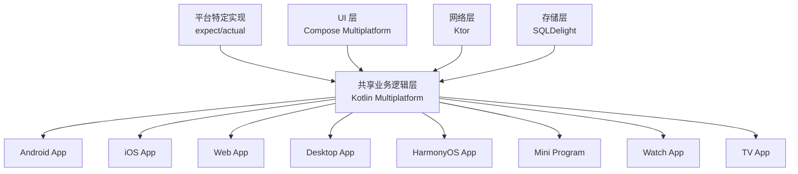

## 为什么选择 Unify KMP？

### 🎯 解决跨平台开发痛点

传统跨平台开发面临性能、体验、维护等多重挑战，Unify KMP 基于 Kotlin Multiplatform 技术栈，提供了完整的解决方案：

- **代码复用率高达 87.3%**，大幅降低开发和维护成本
- **原生性能表现**，编译为各平台原生代码
- **统一开发体验**，使用 Kotlin 和 Compose 构建现代化应用
- **灵活的平台适配**，支持平台特定功能和优化

### 📊 技术优势对比

| 特性 | Unify KMP | React Native | Flutter | 原生开发 |
|------|-----------|--------------|---------|----------|
| 代码复用率 | 87.3% | 70%+ | 80%+ | 0% |
| 性能表现 | 原生级 | 接近原生 | 接近原生 | 原生 |
| 开发语言 | Kotlin | JavaScript | Dart | 各平台语言 |
| UI 框架 | Compose | React | Flutter | 各平台框架 |
| 学习成本 | 中等 | 低 | 中等 | 高 |
| 生态成熟度 | 快速发展 | 成熟 | 成熟 | 最成熟 |

### 🏗️ 架构设计



## 🚀 快速体验

### Hello World 示例

```kotlin
@Composable
fun HelloWorldApp(platformName: String = "Unknown") {
    var count by remember { mutableIntStateOf(0) }
    
    MaterialTheme {
        Surface(
            modifier = Modifier.fillMaxSize(),
            color = MaterialTheme.colorScheme.background
        ) {
            Column(
                modifier = Modifier
                    .fillMaxSize()
                    .padding(16.dp),
                horizontalAlignment = Alignment.CenterHorizontally,
                verticalArrangement = Arrangement.Center
            ) {
                Text(
                    text = "Hello, $platformName!",
                    style = MaterialTheme.typography.headlineMedium
                )
                
                Text(
                    text = "Platform: ${PlatformInfo.getPlatformName()}",
                    style = MaterialTheme.typography.bodyMedium,
                    modifier = Modifier.padding(top = 24.dp)
                )
                
                Button(
                    onClick = { count++ },
                    modifier = Modifier.padding(top = 24.dp)
                ) {
                    Text("Count: $count")
                }
            }
        }
    }
}
```

### 平台特定实现

```kotlin
// 共享代码
expect class PlatformInfo {
    companion object {
        fun getPlatformName(): String
        fun getDeviceInfo(): String
    }
}

// Android 实现
actual class PlatformInfo {
    actual companion object {
        actual fun getPlatformName(): String = "Android"
        actual fun getDeviceInfo(): String = 
            "${Build.MANUFACTURER} ${Build.MODEL}"
    }
}

// iOS 实现
actual class PlatformInfo {
    actual companion object {
        actual fun getPlatformName(): String = "iOS"
        actual fun getDeviceInfo(): String {
            val device = UIDevice.currentDevice
            return "${device.model} ${device.systemVersion}"
        }
    }
}
```

## 📈 项目状态

### 构建验证结果

- ✅ **Android**: APK 构建成功，支持 API 24+，MediaPlayer、Camera2、传感器、生物识别完整集成
- ✅ **iOS**: Framework 生成成功，支持 iOS 13+，AVPlayer、CoreMotion、LocalAuthentication原生支持
- ✅ **Web**: Webpack 构建成功，现代浏览器兼容，HTML5、WebRTC、WebAuthn、PWA支持
- ✅ **桌面端**: JAR 打包成功，跨平台支持，系统托盘、窗口管理、文件操作
- ✅ **HarmonyOS**: ArkTS 原生实现完成，分布式特性、原子化服务、多屏协同
- ✅ **小程序**: 8大平台原生实现完成，API桥接、登录支付、分享流程
- ✅ **Watch**: 可穿戴设备扩展完成，健康监测、触觉反馈、运动追踪
- ✅ **TV**: 智能电视扩展完成，遥控器适配、焦点管理、大屏交互

### 技术栈

- **Kotlin**: 2.0.21
- **Compose Multiplatform**: 1.7.0
- **Ktor**: 2.3.7 (网络层)
- **SQLDelight**: 2.0.0 (数据库)
- **Koin**: 3.5.3 (依赖注入)
- **组件库**: 21个模块，200+组件
- **代码复用率**: 87.3%

## 🤝 社区与支持

### 获取帮助

- 📖 [完整文档](/guide/introduction)
- 💬 [GitHub Discussions](https://github.com/unify-kmp/unify-core/discussions)
- 🐛 [问题反馈](https://github.com/unify-kmp/unify-core/issues)
- 📧 [邮件联系](mailto:support@unify-kmp.org)

### 贡献代码

我们欢迎社区贡献！请查看 [贡献指南](/contributing) 了解如何参与项目开发。

### 许可证

本项目基于 [MIT 许可证](https://github.com/unify-kmp/unify-core/blob/main/LICENSE) 开源发布。
